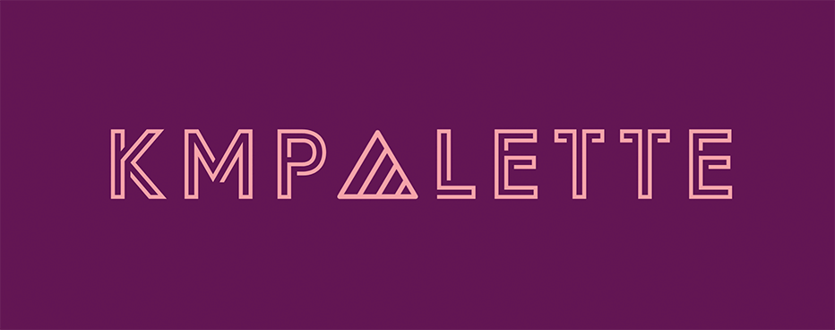

<br />


[](http://kotlinlang.org)
[](https://github.com/jordond/kmpalette/actions/workflows/ci.yml)
[](https://opensource.org/license/mit/)

[](https://github.com/JetBrains/compose-multiplatform)


A Compose Multiplatform library for generating color palettes from images, including the dominant
color. You can use this library in combination
with [MaterialKolor](https://github.com/jordond/materialkolor) to generate dynamic Material
themes based on images.

Supports loading images from several sources, see [sources](#sources).

**Note:** This is a port of
the [`androidx.palette`](https://developer.android.com/jetpack/androidx/releases/palette)
library. And when/if that library ever goes multiplatform, this library will be archived.


## Table of Contents

- [Platforms](#platforms)
- [Inspiration](#inspiration)
- [Dynamic Material Themes](#dynamic-material-themes)
- [Setup](#setup)
    - [Version Catalog](#version-catalog)
- [Usage](#usage)
    - [Dominant Color](#dominant-color)
    - [Generate a color Palette](#generate-a-color-palette)
    - [Sources](#sources)
- [Demo](#demo)
- [Feature Requests](#feature-requests)
- [Contributing](#contributing)
- [License](#license)
    - [Changes from original source](#changes-from-original-source)

## Platforms

This library is written for Compose Multiplatform, and can be used on the following platforms:

- Android
- iOS / MacOS
- JVM (Desktop)

## Inspiration

I created this library because I wanted to use the
[`androidx.palette`](https://developer.android.com/jetpack/androidx/releases/palette) library in a
Compose Multiplatform app. But that library is not multiplatform, so I decided to port it.

## Dynamic Material Themes

Want to create a dynamic Material theme based on the dominant color in an image?

Check out my other Compose Multiplatform
library [MaterialKolor](https://github.com/jordond/materialkolor)!

## Setup

You can add this library to your project using Gradle. There are several optional extension
libraries, see [sources](#sources).

### Version Catalog

In `libs.versions.toml`:

```toml
[versions]
kmpalette = "1.0.0"

[libraries]
kmpalette-core = { module = "dev.jordond.kmpalette:kmpalette-core", version.ref = "kmpalette" }
# Optional source libraries
kmpalette-extensions-base64 = { module = "dev.jordond.kmpalette:extensions-base64", version.ref = "kmpalette" }
kmpalette-extensions-bytearray = { module = "dev.jordond.kmpalette:extensions-bytearray", version.ref = "kmpalette" }
kmpalette-extensions-libres = { module = "dev.jordond.kmpalette:extensions-libres", version.ref = "kmpalette" }
kmpalette-extensions-network = { module = "dev.jordond.kmpalette:extensions-network", version.ref = "kmpalette" }
kmpalette-extensions-resources = { module = "dev.jordond.kmpalette:extensions-resources", version.ref = "kmpalette" }
```

To add to a multiplatform project, add the dependency to the common source-set:

```kotlin
kotlin {
    sourceSets {
        commonMain {
            dependencies {
                // Core library
                implementation(libs.kmpalette.core)

                // Optional extensions based on your image source
                implementation(libs.kmpalette.extensions.base64)
                implementation(libs.kmpalette.extensions.bytearray)
                implementation(libs.kmpalette.extensions.libres)
                implementation(libs.kmpalette.extensions.network)
                implementation(libs.kmpalette.extensions.resources)
            }
        }
    }
}
```

## Usage

In order to use this library you first must have a `ImageBitmap` object. You can get this from using
one of the [sources](#sources) or by using a library that creates one for you.

Since this library is a port of
the [`androidx.palette`](https://developer.android.com/jetpack/androidx/releases/palette) library,
the usage is very similar. However this library provides some helpful extension functions and
composables.

Look in `kmpalette-core` for the main library, including extensions for the `Palette` and `Swatch`
objects.

Included are two helpful `@Composeable`-ready State objects:

- `DominantColorState` - A state object that holds a generated dominant `Color` object.
- `PaletteState` - A state object that holds a generated `Palette` object.

They can be used like so:

### Dominant Color

You can generate a dominant color from an `ImageBitmap` using the `rememberDominantColorState`
composeable. This will also provide a `onColor` for you to use as a text color.

```kotlin
@Composable
fun SomeComposable(bitmap: ImageBitmap) {
    val dominantColorState = rememberDominantColorState()
    LaunchedEffect(bitmap) {
        dominantColorState.updateFrom(bitmap)
    }

    Box(
        modifier = Modifier
            .width(200.dp)
            .height(100.dp)
            .background(dominantColorState.color)
    ) {
        Text("Some Text", color = dominantColorState.onColor)
    }
}
```

Since the generation of the dominant color is an asynchronous operation that can fail, you can track
the results of the operation using the `DominantColorState.result` object.

For more examples of getting a dominant color see
the [demo app](demo/composeApp/src/commonMain/kotlin/dev/jordond/kmpalette/dominant)

### Generate a color Palette

If you want a whole color palette instead of just a dominate color, you can use
the `rememberPaletteState` composeable. This will provide a `Palette` object which contains a few
different color `Swatch`s, each have their own color and _onColor_.

```kotlin
fun SomeComposable(bitmap: ImageBitmap) {
    val paletteState = rememberPaletteState()
    LaunchedEffect(bitmap) {
        paletteState.generate(bitmap)
    }

    Box(
        modifier = Modifier
            .width(200.dp)
            .height(100.dp)
            .background(paletteState.vibrantSwatch?.color ?: Color.White)
    ) {
        Text(
            "Some Text",
            color = paletteState.vibrantSwatch?.onColor ?: Color.Black,
        )
    }
}
```

Since the generation of the dominant color is an asynchronous operation that can fail, you can track
the results of the operation using the `DominantColorState.result` object.

For more examples of generating a Palette see
the [demo app](demo/composeApp/src/commonMain/kotlin/dev/jordond/kmpalette/palette)

### Sources

In order to generate a color palette, you must first have an `ImageBitmap` object. This library
provides some extensions artifacts for some popular sources.

|                         Artifact                         | Library                                                                                                                | Loader            | Input Class | Demo                                                                                                                      |
|:--------------------------------------------------------:|------------------------------------------------------------------------------------------------------------------------|-------------------|-------------|---------------------------------------------------------------------------------------------------------------------------|
|    [`extensions-base64`](extensions-base64/README.md)    | N/A                                                                                                                    | `Base64Loader`    | `String`    | [`Base64DemoScreen`](demo/composeApp/src/commonMain/kotlin/dev/jordond/kmpalette/dominant/Base64DemoScreen.kt)            |
| [`extensions-bytearray`](extensions-bytearray/README.md) | N/A                                                                                                                    | `ByteArrayLoader` | `ByteArray` | N/A                                                                                                                       |
|    [`extensions-libres`](extensions-libres/README.md)    | [libres](https://github.com/Skeptick/libres)                                                                           | `LibresLoader`    | `Image`     | [`LibresPaletteScreen`](demo/composeApp/src/commonMain/kotlin/dev/jordond/kmpalette/palette/LibresPaletteScreen.kt)       |
|   [`extensions-network`](extensions-network/README.md)   | [ktor](https://github.com/ktorio/ktor)                                                                                 | `NetworkLoader`   | `Url`       | [`NetworkDemoScreen`](demo/composeApp/src/commonMain/kotlin/dev/jordond/kmpalette/dominant/NetworkDemoScreen.kt)          |
| [`extensions-resources`](extensions-resources/README.md) | [Compose Multiplatform Resources](https://github.com/JetBrains/compose-multiplatform/tree/master/components/resources) | `ResourceLoader`  | `Resource`  | [`ResourcesPaletteScreen`](demo/composeApp/src/commonMain/kotlin/dev/jordond/kmpalette/palette/ResourcesPaletteScreen.kt) |

Each of these extensions provides a `ImageBitmapLoader` object that can be used to generate
an `ImageBitmap` from the input class. For example, the `NetworkLoader` can be used to generate
an `ImageBitmap` from a `Url`:

```kotlin
@Composable
fun SomeComposable(url: Url) {
    val dominantColorState = rememberDominantColorState(loader = NetworkLoader())
    LaunchedEffect(url) {
        dominantColorState.updateFrom(url)
    }

    Box(
        modifier = Modifier
            .width(200.dp)
            .height(100.dp)
            .background(dominantColorState.color)
    ) {
        Text("Some Text", color = dominantColorState.onColor)
    }
}
```

## Demo

A demo app is available in the `demo` directory. It is a Compose Multiplatform app that runs on
Android, iOS and Desktop.

See the [README](demo/README.md) for more information.

## Feature Requests

If you have a feature request, please open an issue. If you would like to implement a feature
request refer to the [Contributing](#contributing) section.

## Contributing

Contributions are always welcome!. If you'd like to contribute, please feel free to create a PR or
open an issue.

## License

The module `androidx-palette` is licensed under the Apache License, Version 2.0. See
their [LICENSE](androidx-palette/LICENSE) and their
repository [here](https://github.com/androidx/androidx/tree/androidx-main/palette) for more
information.

### Changes from original source

- Convert Java code to Kotlin
- Convert library to Kotlin Multiplatform

For the remaining code see [LICENSE](LICENSE) for more information.
