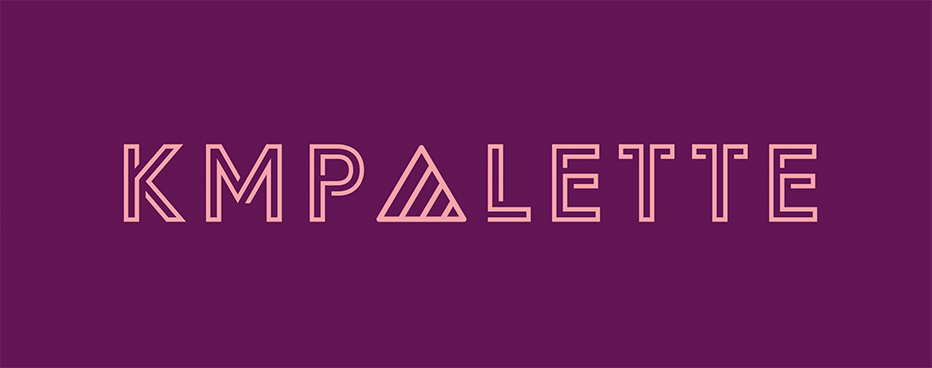

<br />


[](http://kotlinlang.org)
[](https://github.com/jordond/kmpalette/actions/workflows/ci.yml)
[](https://opensource.org/license/mit/)

[](https://github.com/JetBrains/compose-multiplatform)


A Kotlin Multiplatform library for generating color palettes from images, including the dominant
color. You can use this library in combination
with [MaterialKolor](https://github.com/jordond/materialkolor) to generate dynamic Material
themes based on images.

Supports loading images from several sources, see [Loaders](#loaders).

**Note:** This is a port of
the [`androidx.palette`](https://developer.android.com/jetpack/androidx/releases/palette)
library.

## Table of Contents

- [What's New in 4.0](#whats-new-in-40)
- [Platforms](#platforms)
- [Architecture](#architecture)
- [Inspiration](#inspiration)
- [Dynamic Material Themes](#dynamic-material-themes)
- [Setup](#setup)
    - [Version Catalog](#version-catalog)
- [Standalone Palette (No Compose)](#standalone-palette-no-compose)
- [Usage](#usage)
    - [One-shot Generation](#one-shot-generation)
    - [PaletteResult](#paletteresult)
    - [Dominant Color](#dominant-color)
    - [Generate a color Palette](#generate-a-color-palette)
    - [Selecting Swatches](#selecting-swatches)
    - [Swatch Colors](#swatch-colors)
    - [Caching](#caching)
    - [Loaders](#loaders)
- [Migration](#migration)
- [Feature Requests](#feature-requests)
- [Contributing](#contributing)
- [License](#license)
    - [Changes from the original source](#changes-from-the-original-source)

## What's New in 4.0

Version 4.0 is a significant rewrite. The highlights:

- **`androidx-palette` is now a dependency-free Kotlin Multiplatform module.** It no longer depends
  on Compose or Skiko. `Palette.Builder` now takes raw pixel data (`IntArray` + width + height)
  instead of an `ImageBitmap`, and downscaling is a pure-Kotlin nearest-neighbour implementation.
- **New `kmpalette-loader` module** (published as `loader`) containing the `ImageBitmapLoader`
  interface, so extensions can
  depend on the loader contract without pulling in all of `core`.
- **New Maven coordinates.** The group is now `com.materialkolor.palette` and the core artifact is
  named `core`.
- **`PaletteResult`**: a sealed `Loading`/`Success`/`Error` result type replaces the previous
  ad-hoc state handling.
- **One-shot APIs**: `ImageBitmap.generatePalette()` and `ImageBitmap.rememberGeneratePalette()`
  for when you don't need a full state object.
- **`SwatchTarget`**: a Kotlin-friendly sealed interface over `Target`, with `Palette.get(target)`
  operator access.
- **`ByteArrayLoader` moved into `core`.** The `extensions-bytearray` artifact is gone.
- **Dedicated composables per loader** (`rememberBase64PaletteState`, `rememberNetworkPaletteState`,
  `rememberPlatformFilePaletteState`, and so on) so you no longer wire loaders up by hand.
- **`extensions-file` now uses [FileKit](https://github.com/vinceglb/FileKit)** instead of Okio.
- **The `macosX64` target was removed.** Kotlin/Native no longer supports Intel macOS, so all
  artifacts now publish `macosArm64` only.
- **No Material 3 dependency.** Dominant-color composables no longer fall back to
  `MaterialTheme.colorScheme`, so `defaultColor` and `defaultOnColor` are always required and the
  library makes no assumption about your design system.
- **One cache default.** A single top-level `DEFAULT_CACHE_SIZE` replaces the per-class constants.
- **Painter composables live in `com.kmpalette.extensions.painter`,** alongside the resource and
  drawable ones. The duplicates in `com.kmpalette` are gone.

See the [Migration Guide](MIGRATION.md) for upgrade instructions.

## Platforms

| Artifact             | Android | Desktop | iOS | macOS | JS | WASM |
|----------------------|:-------:|:-------:|:---:|:-----:|:--:|:----:|
| `androidx-palette`   |    ✅    |    ✅    |  ✅  |   ✅   | ✅  |  ✅   |
| `kmpalette-loader`   |    ✅    |    ✅    |  ✅  |   ✅   | ✅  |  ✅   |
| `core`               |    ✅    |    ✅    |  ✅  |   ✅   | ✅  |  ✅   |
| `extensions-base64`  |    ✅    |    ✅    |  ✅  |   ✅   | ✅  |  ✅   |
| `extensions-network` |    ✅    |    ✅    |  ✅  |   ✅   | ✅  |  ✅   |
| `extensions-file`    |    ✅    |    ✅    |  ✅  |   ✅   | ✅  |  ✅   |

Apple targets are Apple Silicon only: `macosArm64`, `iosArm64`, and `iosSimulatorArm64`. The
deprecated `macosX64` (Intel macOS) target was **removed in 4.0**.

## Architecture

The library is layered so you only take on the dependencies you actually need:

```
androidx-palette      Pure Kotlin palette generation. No Compose. Works on raw IntArray pixels.
      ▲
kmpalette-loader      The ImageBitmapLoader<T> interface. Depends only on Compose UI graphics.
      ▲
core                  Compose state objects, Palette/Swatch extensions, and the built-in loaders.
      ▲               Exposes androidx-palette and kmpalette-loader via `api`.
extensions-*          Optional loaders and composables for specific image sources.
```

`core` depends on `androidx-palette` and `kmpalette-loader` with `api`, so adding `core` is enough
to get all three. The `extensions-*` artifacts depend on `core` with `implementation`, so you must
declare `core` yourself alongside any extension.

## Inspiration

I created this library because I wanted to use the
[`androidx.palette`](https://developer.android.com/jetpack/androidx/releases/palette) library in a
Compose Multiplatform app. But that library is not multiplatform, so I decided to port it.

## Dynamic Material Themes

Want to create a dynamic Material theme based on the dominant color in an image?

Check out my other Compose Multiplatform
library [MaterialKolor](https://github.com/jordond/materialkolor)!

## Setup

You can add this library to your project using Gradle. There are several optional extension
libraries, see [Loaders](#loaders).

### Version Catalog

In `libs.versions.toml`:

```toml
[versions]
kmpalette = "4.0.0"

[libraries]
kmpalette-core = { module = "com.materialkolor.palette:core", version.ref = "kmpalette" }
# Optional - standalone palette generation without Compose
kmpalette-androidx-palette = { module = "com.materialkolor.palette:androidx-palette", version.ref = "kmpalette" }
# Optional - only needed if you implement ImageBitmapLoader without depending on core
kmpalette-loader = { module = "com.materialkolor.palette:loader", version.ref = "kmpalette" }
# Optional source libraries
kmpalette-extensions-base64 = { module = "com.materialkolor.palette:extensions-base64", version.ref = "kmpalette" }
kmpalette-extensions-network = { module = "com.materialkolor.palette:extensions-network", version.ref = "kmpalette" }
kmpalette-extensions-file = { module = "com.materialkolor.palette:extensions-file", version.ref = "kmpalette" }
```

To add to a multiplatform project, add the dependency to the common source-set:

```kotlin
kotlin {
    sourceSets {
        commonMain.dependencies {
            // Core library (includes Compose utilities)
            implementation(libs.kmpalette.core)

            // Or use just the palette generation without Compose
            // implementation(libs.kmpalette.androidx.palette)

            // Optional extensions based on your image source.
            // These require `core` to be declared as well.
            implementation(libs.kmpalette.extensions.base64)
            implementation(libs.kmpalette.extensions.network)
            implementation(libs.kmpalette.extensions.file)
        }
    }
}
```

`extensions-file` does not expose FileKit transitively, so add it yourself if you need to construct
a `PlatformFile`:

```kotlin
implementation("io.github.vinceglb:filekit-core:<version>")
```

## Standalone Palette (No Compose)

The `androidx-palette` module is a full Kotlin Multiplatform port of
the [`androidx.palette`](https://developer.android.com/jetpack/androidx/releases/palette) library.
As of 4.0 it has **no dependency on Compose** (its only dependency is `androidx.annotation`), and it
can be used in any Kotlin Multiplatform project.

```kotlin
kotlin {
    sourceSets {
        commonMain.dependencies {
            implementation(libs.kmpalette.androidx.palette)
        }
    }
}
```

Because the module is Compose-free, it works on raw pixel data rather than an `ImageBitmap`. You
supply an ARGB `IntArray` along with the source dimensions:

```kotlin
val palette = Palette
    .from(pixels, width, height)
    .maximumColorCount(16)
    .generate()

val vibrant = palette.vibrantSwatch
val dominant = palette.dominantSwatch
```

The builder also accepts a list of pre-computed swatches:

```kotlin
val palette = Palette.from(swatches)
```

Useful `Palette.Builder` options:

| Method                                                   | Description                                                                           |
|----------------------------------------------------------|---------------------------------------------------------------------------------------|
| `maximumColorCount(colors)`                              | Maximum number of colors in the generated palette.                                     |
| `resizeBitmapArea(area)`                                 | Target pixel area to downscale to before quantizing. Defaults to `112 * 112`.          |
| `scaling(enabled)`                                       | Enable or disable the built-in nearest-neighbour downscaling.                          |
| `setRegion(left, top, right, bottom)`                    | Restrict generation to a region. Plain `Int`s, not `Rect`.                            |
| `setRegionCoordinateSpace(width, height)`                | Declare the coordinate space the region is expressed in (used when you pre-scaled).    |
| `clearRegion()`                                          | Clear a previously set region.                                                         |
| `addFilter(filter)` / `clearFilters()`                   | Add or remove `Palette.Filter`s.                                                       |
| `addTarget(target)` / `clearTargets()`                   | Add or remove `Target`s.                                                               |

The `core` module includes `androidx-palette` as a transitive dependency, so you don't need to add
both. Use `androidx-palette` on its own when you want palette generation without pulling in Compose.

## Usage

To see the generated KDocs, visit [docs.kmpalette.com](https://docs.kmpalette.com/)

To use this library, you first need an `ImageBitmap`, or one of the input types supported by
a [loader](#loaders).

If you already have an `ImageBitmap`, `core` adds a Compose-aware `Palette.from` overload that
handles pixel extraction and downscaling for you:

```kotlin
val builder = Palette.from(bitmap)          // scales down to Palette.DEFAULT_RESIZE_BITMAP_AREA
val builder = Palette.from(bitmap, scale = false)  // use the full-size bitmap
val palette = Palette.from(bitmap) { maximumColorCount(24) }.generate()
```

### One-shot Generation

When you don't need a reusable state object, generate a palette directly.

From a coroutine:

```kotlin
suspend fun load(bitmap: ImageBitmap): Palette = bitmap.generatePalette()
```

From a composable, which returns a [`PaletteResult`](#paletteresult) and re-runs when the bitmap
changes:

```kotlin
@Composable
fun SomeComposable(bitmap: ImageBitmap) {
    val result = bitmap.rememberGeneratePalette()

    when (result) {
        is PaletteResult.Loading -> CircularProgressIndicator()
        is PaletteResult.Error -> Text("Failed: ${result.cause.message}")
        is PaletteResult.Success -> Text("Got ${result.palette.swatches.size} swatches")
    }
}
```

There is also an overload that takes a suspending loader lambda, so the image load and the palette
generation are handled together:

```kotlin
@Composable
fun SomeComposable(bytes: ByteArray) {
    val result = rememberGeneratePalette(loader = { ByteArrayLoader.load(bytes) })
    val palette = result.paletteOrNull
}
```

### PaletteResult

Every asynchronous operation reports through `PaletteResult`:

```kotlin
public sealed interface PaletteResult {
    public data class Success(val palette: Palette) : PaletteResult
    public data object Loading : PaletteResult
    public data class Error(val cause: Exception) : PaletteResult

    public val paletteOrNull: Palette?
}
```

Use `paletteOrNull` when you only care about the happy path.

### Dominant Color

You can generate a dominant color from an `ImageBitmap` using the `rememberDominantColorState`
composable. This will also provide an `onColor` for you to use as a text color.

```kotlin
@Composable
fun SomeComposable(bitmap: ImageBitmap) {
    val dominantColorState = rememberDominantColorState(
        defaultColor = Color.Black,
        defaultOnColor = Color.White,
    )
    LaunchedEffect(bitmap) {
        dominantColorState.updateFrom(bitmap)
    }

    Box(
        modifier = Modifier
            .width(200.dp)
            .height(100.dp)
            .background(dominantColorState.color)
    ) {
        Text("Some Text", color = dominantColorState.onColor)
    }
}
```

You can also use a `Painter` object with the dedicated `rememberPainterDominantColorState`:

```kotlin
import com.kmpalette.extensions.painter.rememberPainterDominantColorState

@Composable
fun SomeComposable(painter: Painter) {
    val dominantColorState = rememberPainterDominantColorState(
        defaultColor = Color.Black,
        defaultOnColor = Color.White,
    )
    LaunchedEffect(painter) {
        dominantColorState.updateFrom(painter)
    }

    // ...
}
```

> **Note on default colors.** Every dominant-color composable requires `defaultColor` and
> `defaultOnColor`. They are shown until generation succeeds, and whenever it fails. The library
> does not guess a fallback, so it makes no assumption about your design system and does not depend
> on Material 3. Pass whatever your theme uses:
>
> ```kotlin
> // Material 3
> val state = rememberBase64DominantColorState(
>     defaultColor = MaterialTheme.colorScheme.primary,
>     defaultOnColor = MaterialTheme.colorScheme.onPrimary,
> )
>
> // or anything else
> val state = rememberBase64DominantColorState(
>     defaultColor = MyTheme.colors.surface,
>     defaultOnColor = MyTheme.colors.onSurface,
> )
> ```

Since the generation of the dominant color is an asynchronous operation that can fail, you can track
the results of the operation using the `DominantColorState.result` property, which is a
[`PaletteResult`](#paletteresult).

If you want to filter the dominant color, you can pass an `isSwatchValid` lambda:

```kotlin
val dominantColorState = rememberDominantColorState(
    defaultColor = Color.Black,
    defaultOnColor = Color.White,
    isSwatchValid = { swatch -> swatch.population > 100 },
)
LaunchedEffect(bitmap) {
    dominantColorState.updateFrom(bitmap)
}
```

Swatches are checked in descending population order, and the first valid one wins.

### Generate a color Palette

If you want a whole color palette instead of just a dominant color, you can use
the `rememberPaletteState` composable. The generated `Palette` is exposed through
`PaletteState.palette`, and the full result through `PaletteState.state`.

Using an `ImageBitmap`:

```kotlin
@Composable
fun SomeComposable(bitmap: ImageBitmap) {
    val paletteState = rememberPaletteState()
    LaunchedEffect(bitmap) {
        paletteState.generate(bitmap)
    }

    val vibrant = paletteState.palette?.vibrantSwatch

    Box(
        modifier = Modifier
            .width(200.dp)
            .height(100.dp)
            .background(vibrant?.color ?: Color.White)
    ) {
        Text(
            text = "Some Text",
            color = vibrant?.onColor ?: LocalContentColor.current,
        )
    }
}
```

Or using a `Painter`:

```kotlin
@Composable
fun SomeComposable(painter: Painter) {
    val paletteState = rememberPainterPaletteState()
    LaunchedEffect(painter) {
        paletteState.generate(painter)
    }

    // ...
}
```

`PaletteState.state` is a [`PaletteResult`](#paletteresult), so you can render loading and error
states directly:

```kotlin
when (val state = paletteState.state) {
    null -> Text("Nothing generated yet")
    PaletteResult.Loading -> CircularProgressIndicator()
    is PaletteResult.Error -> Text("Failed: ${state.cause.message}")
    is PaletteResult.Success -> PaletteDisplay(state.palette)
}
```

### Selecting Swatches

Alongside the standard `vibrantSwatch`, `mutedSwatch`, `dominantSwatch` (and friends) properties,
`core` adds `SwatchTarget`, a sealed interface that maps to `androidx-palette`'s `Target`, plus an
indexed accessor:

```kotlin
val vibrant = palette[SwatchTarget.Vibrant]
val darkMuted = palette[SwatchTarget.MutedDark]

// Equivalent, non-operator form
val lightVibrant = palette.getSwatch(SwatchTarget.VibrantLight)
```

| `SwatchTarget`  | Equivalent property   |
|-----------------|-----------------------|
| `Vibrant`       | `vibrantSwatch`       |
| `VibrantDark`   | `darkVibrantSwatch`   |
| `VibrantLight`  | `lightVibrantSwatch`  |
| `Muted`         | `mutedSwatch`         |
| `MutedDark`     | `darkMutedSwatch`     |
| `MutedLight`    | `lightMutedSwatch`    |

The raw `Target` type works too, if you built a custom one:

```kotlin
val swatch = palette[Target.VIBRANT]
```

### Swatch Colors

`core` provides Compose `Color` extensions on `Palette.Swatch`:

| Extension           | Description                                                   |
|---------------------|---------------------------------------------------------------|
| `swatch.color`      | The swatch color.                                             |
| `swatch.onColor`    | Title text color, guaranteed to contrast against `color`.     |
| `swatch.titleTextColor()` | Same as `onColor`.                                      |
| `swatch.bodyTextColor()`  | Body text color, guaranteed to contrast against `color`. |

Note that `DominantColorState.onColor` is derived from the swatch's *body* text color, whereas
`Swatch.onColor` is the *title* text color.

### Caching

Both state objects keep an LRU cache of results, keyed on the input. Every state function defaults
to `DEFAULT_CACHE_SIZE`. Pass `cacheSize = 0` to disable caching, and call `reset()` to clear the
cache and return to the default values.

```kotlin
val paletteState = rememberPaletteState(cacheSize = 0)

// later
paletteState.reset()
```

```kotlin
public const val DEFAULT_CACHE_SIZE: Int = 6
```

Note that the cache is keyed on the input, so an `ImageBitmap` or `Painter` key keeps that object
alive for as long as it stays in the cache. Pass `cacheSize = 0` for those inputs if that matters
to you.

### Loaders

A loader implements `ImageBitmapLoader<T>` from the `kmpalette-loader` module:

```kotlin
public interface ImageBitmapLoader<T> {
    public suspend fun load(input: T): ImageBitmap
}
```

`core` ships with these loaders:

| Loader             | Input                  | Availability   | Notes                                          |
|--------------------|------------------------|----------------|------------------------------------------------|
| `ByteArrayLoader`  | `ByteArray`            | All            | Was `extensions-bytearray` in 3.x.             |
| `PainterLoader`    | `Painter`              | All            | Use `rememberPainterLoader()`.                 |
| `ResourceLoader`   | `DrawableResource`     | All            | Use `rememberResourceLoader()`.                |
| `DrawableLoader`   | `@DrawableRes Int`     | Android only   | Use `rememberDrawableLoader()`.                |

And these are available as separate artifacts:

| Artifact                                             | Library                                        | Loader               | Input          |
|------------------------------------------------------|------------------------------------------------|----------------------|----------------|
| [`extensions-base64`](extensions-base64/README.md)   | N/A                                            | `Base64Loader`       | `String`       |
| [`extensions-network`](extensions-network/README.md) | [Ktor](https://github.com/ktorio/ktor)         | `NetworkLoader`      | `Url`          |
| [`extensions-file`](extensions-file/README.md)       | [FileKit](https://github.com/vinceglb/FileKit) | `PlatformFileLoader` | `PlatformFile` |
| [`extensions-file`](extensions-file/README.md)       | N/A                                            | `FileLoader`         | `java.io.File` (Android only) |

Every loader has a matching pair of composables:

| Input              | Dominant color                             | Palette                              |
|--------------------|--------------------------------------------|--------------------------------------|
| `ImageBitmap`      | `rememberDominantColorState()`             | `rememberPaletteState()`             |
| `Painter`          | `rememberPainterDominantColorState()`¹     | `rememberPainterPaletteState()`¹     |
| `DrawableResource` | `rememberResourceDominantColorState()`     | `rememberResourcePaletteState()`     |
| `@DrawableRes Int` | `rememberDrawableDominantColorState()`     | `rememberDrawablePaletteState()`     |
| `String` (Base64)  | `rememberBase64DominantColorState()`       | `rememberBase64PaletteState()`       |
| `Url`              | `rememberNetworkDominantColorState()`      | `rememberNetworkPaletteState()`      |
| `PlatformFile`     | `rememberPlatformFileDominantColorState()` | `rememberPlatformFilePaletteState()` |
| `java.io.File`     | `rememberFileDominantColorState()`         | `rememberFilePaletteState()`         |

¹ In `com.kmpalette.extensions.painter`, matching the resource and drawable composables. All
dominant-color functions require `defaultColor` and `defaultOnColor`.

For example, the `extensions-network` module:

```kotlin
@Composable
fun SomeComposable(url: Url) {
    val dominantColorState = rememberNetworkDominantColorState(
        defaultColor = MaterialTheme.colorScheme.primary,
        defaultOnColor = MaterialTheme.colorScheme.onPrimary,
    )
    LaunchedEffect(url) {
        dominantColorState.updateFrom(url)
    }

    Box(
        modifier = Modifier
            .width(200.dp)
            .height(100.dp)
            .background(dominantColorState.color)
    ) {
        Text("Some Text", color = dominantColorState.onColor)
    }
}
```

You can always fall back to the generic state functions and pass a loader yourself:

```kotlin
val paletteState = rememberPaletteState(loader = ByteArrayLoader)
LaunchedEffect(bytes) {
    paletteState.generate(bytes)
}
```

#### Compose Multiplatform Resources

To generate a palette from a `DrawableResource` use `rememberResourceDominantColorState` or
`rememberResourcePaletteState`, which read the resource bytes directly:

```kotlin
@Composable
fun MyComposable() {
    val dominantColorState = rememberResourceDominantColorState(
        defaultColor = MaterialTheme.colorScheme.primary,
        defaultOnColor = MaterialTheme.colorScheme.onPrimary,
    )
    LaunchedEffect(Unit) {
        dominantColorState.updateFrom(Res.drawable.my_image)
    }
}
```

Alternatively, you can use the `@Composable imageResource()` to get an `ImageBitmap` then pass that
to the default loader:

```kotlin
@Composable
fun MyComposable() {
    val image = imageResource(Res.drawable.my_image)
    val dominantColorState = rememberDominantColorState(
        defaultColor = Color.Black,
        defaultOnColor = Color.White,
    )
    LaunchedEffect(image) {
        dominantColorState.updateFrom(image)
    }
}
```

## Migration

If you are migrating from version 3.x, please see the [Migration Guide](MIGRATION.md) for detailed
instructions on updating your code.

Key changes in 4.0:

- Maven group is now `com.materialkolor.palette`, and `kmpalette-core` is now `core`
- `androidx-palette` no longer depends on Compose; `Palette.Builder` takes `IntArray` pixels
- `kmpalette-bitmap-loader` was renamed to `kmpalette-loader` and is published as `loader`
- `extensions-bytearray` and `extensions-resources` have been folded into `core`
- `extensions-libres` has been removed with no replacement
- `extensions-file` now uses FileKit instead of Okio
- Painter composables moved to `com.kmpalette.extensions.painter`
- `defaultColor` and `defaultOnColor` are required; nothing depends on Material 3
- The `macosX64` and `iosX64` targets were removed

## Feature Requests

If you have a feature request, please open an issue. If you would like to implement a feature
request, refer to the [Contributing](#contributing) section.

## Contributing

Contributions are always welcome! If you'd like to contribute, open a PR or an issue.

## License

The module `androidx-palette` is licensed under the Apache License, Version 2.0. See
their [LICENSE](androidx-palette/LICENSE) and their
repository [here](https://github.com/androidx/androidx/tree/androidx-main/palette) for more
information.

### Changes from the original source

- Convert Java code to Kotlin
- Convert library to Kotlin Multiplatform
- Remove the Compose and Skiko dependencies, operating on raw `IntArray` pixel data instead
- Replace `Rect`-based region selection with plain `Int` coordinates
- Replace platform-specific bitmap scaling with a pure-Kotlin nearest-neighbour implementation

For the remaining code see [LICENSE](LICENSE) for more information.
